# W5 Evidence Pack: The Network Fortress

## Cover

| Field               | Value                                                                               |
| ------------------- | ----------------------------------------------------------------------------------- |
| Group               | Group 5 - Xbrain                                                                    |
| Student             | Hoang Nam                                                                           |
| Target Role         | DevOps / CloudOps                                                                   |
| Repository          | https://github.com/NamHoang4268/w5_group5_namhoang/blob/main/w5/docs/W5_evidence.md |
| Prior Week Evidence | [W4: AI Agent with RAG + Tools + Memory]                                            |
| Deadline            | 2026-06-04                                                                          |
| Application         | GeekBrain — Unified ReAct Agent for platform engineering                            |
| Stack               | ECS Fargate + CloudFront + ALB + Bedrock KB + DynamoDB + EFS                        |
| Deployment          | AWS CLI Scripts (Bash)                                                              |

---

## Architecture Diagram

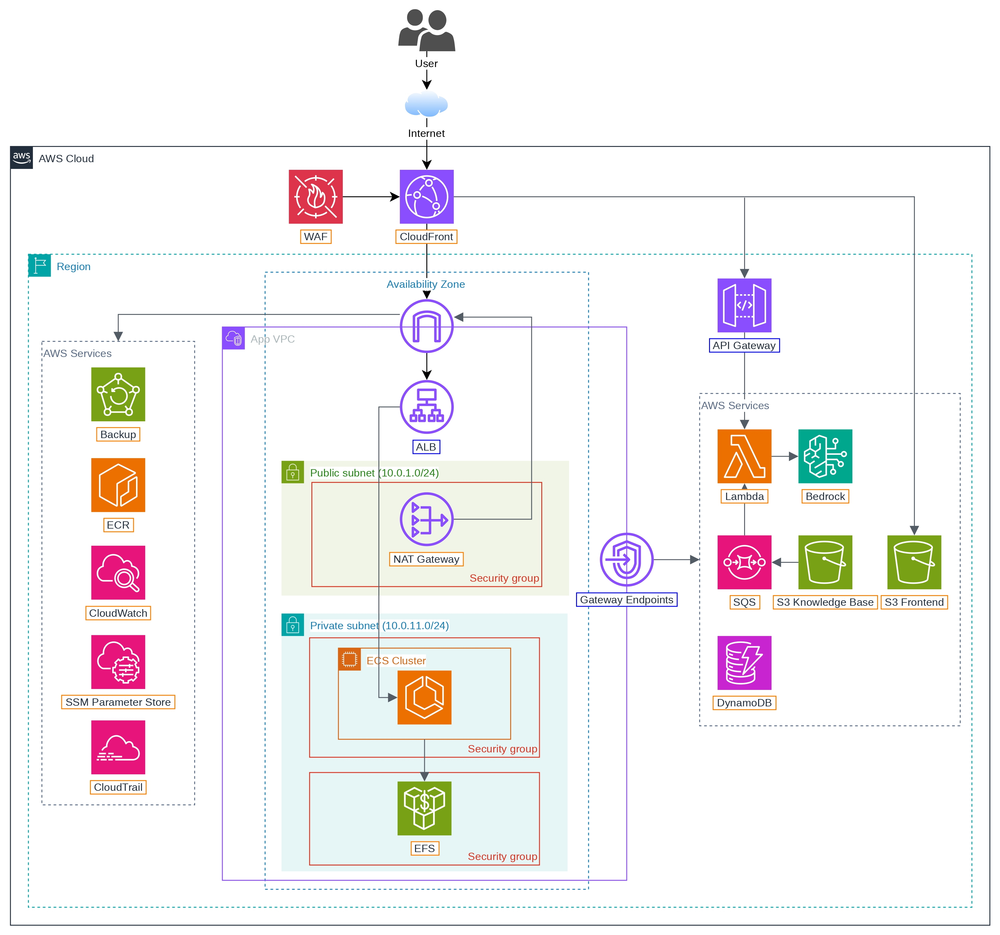

**W5 additions:** Edge Services (WAF + CloudFront) → App VPC with ALB in public subnets, ECS Fargate in private subnets with a NAT Gateway and Gateway Endpoints [MH2], Single VPC design hosting both compute and EFS [MH1, MH3] for cost optimization. AWS services accessed via NAT Gateway and 2 Gateway Endpoints (DynamoDB, S3). API Gateway [MH4] fronts Lambda kb_auto_sync with reserved concurrency + DLQ [MH5].

---

## Prior Feedback Addressed

| W4 Feedback                                                            | How W5 Addresses It                                                                                                                                                                |
| ---------------------------------------------------------------------- | ---------------------------------------------------------------------------------------------------------------------------------------------------------------------------------- |
| "Single EC2 instance is a single point of failure"                     | Migrated to ECS Fargate with ALB health checks, automatic task restart. Running Single-AZ (AZ-a) to optimize personal account costs while maintaining hardware-level availability. |
| "Security posture needs hardening — open egress, no network filtering" | Egress routed securely through a single NAT Gateway. SGs locked to least-privilege. Custom NACL applied to block unauthorized internal access.                                     |
| "No backup or disaster recovery strategy"                              | AWS Backup plan: daily EFS + DynamoDB snapshots, 7-day retention, restore test completed with data verified                                                                        |

---

## MH1 — Multi-VPC Connectivity

### Path C — Single VPC

**Why Single VPC:**

- In a personal account, minimizing Data Transfer costs and infrastructure overhead is critical (Cost-Guard strategy).
- The monolithic application architecture does not require strict multi-tenant or business unit isolation that would justify the complexity of VPC Peering or Transit Gateway.
- Security isolation is fully handled via Public/Private subnets and granular Security Groups.

| VPC           | CIDR        | Purpose                                               |
| ------------- | ----------- | ----------------------------------------------------- |
| xbrain-w5-vpc | 10.0.0.0/16 | ECS Fargate, ALB, EFS, NAT Gateway, Gateway Endpoints |

**Network:** Single VPC deployed in `ap-southeast-1a` to minimize cross-AZ charges.

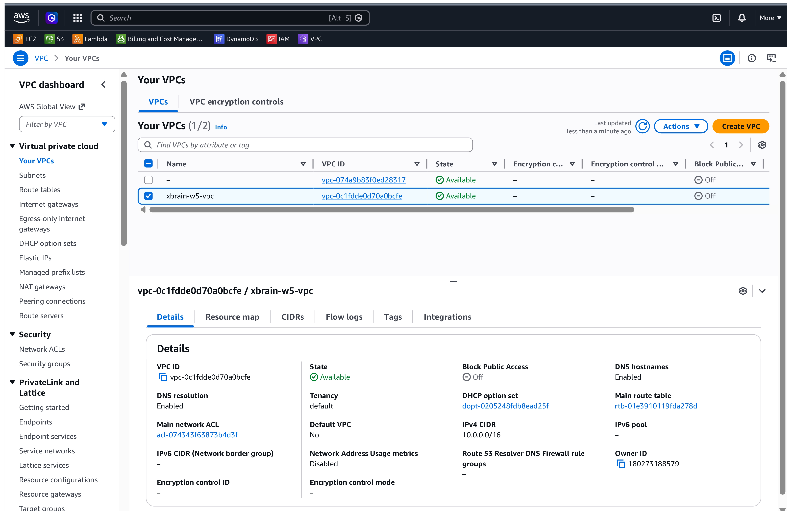

### Route Tables

App VPC public subnet routes `0.0.0.0/0 → igw`. App VPC private subnet routes `0.0.0.0/0 → nat-gateway`. Gateway endpoints route S3 and DynamoDB traffic directly to AWS backbone.

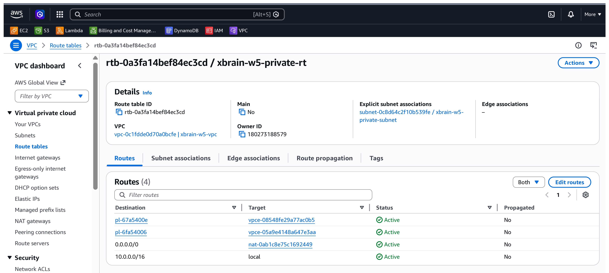

### VPC Flow Logs

Enabled on the VPC, publishing to an S3 bucket:

- App VPC: `arn:aws:s3:::xbrain-w5-flowlogs`

Sample entries showing ACCEPT traffic across Gateway Endpoints and NAT Gateway:

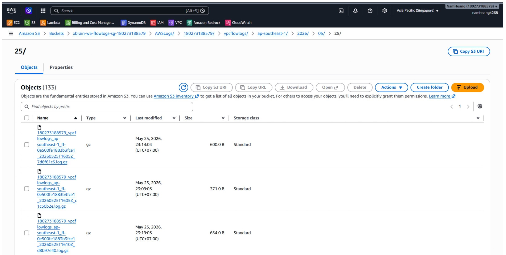

### Intra-VPC Connectivity Test

ECS Fargate tasks in the private subnet (10.0.11.0/24) mount EFS over NFS port 2049. This is a continuous, live connectivity test — every ECS task reads knowledge base documents and writes to SQLite on EFS at runtime. See [MH3 — ECS Task Volumes](#ecs-task-volumes--file-readwrite) for mount evidence and [MH3 — File Read](#ecs-task-volumes--file-readwrite) for CloudWatch Logs showing successful data access. Flow Logs above confirm ACCEPT on this traffic path.

---

## MH2 — Network Security Hardening

### Path B — Hardened SG + NACL

**(a) Egress Strategy (Cost-Optimized):**

The architecture uses a single NAT Gateway to allow ECS Backend tasks to reach the internet (e.g., updating packages, calling the Bedrock API) instead of deploying 7 expensive VPC Interface Endpoints. To satisfy the requirement while adhering to a personal budget (avoiding the ~$285/month AWS Network Firewall), this deployment utilizes Path B (Hardened SGs + NACL) to provide defense-in-depth without the managed firewall overhead.

| Endpoint                | Type    | Service                            |
| ----------------------- | ------- | ---------------------------------- |
| xbrain-w5-vpce-s3       | Gateway | S3 (KB documents, frontend assets) |
| xbrain-w5-vpce-dynamodb | Gateway | DynamoDB (conversation memory)     |

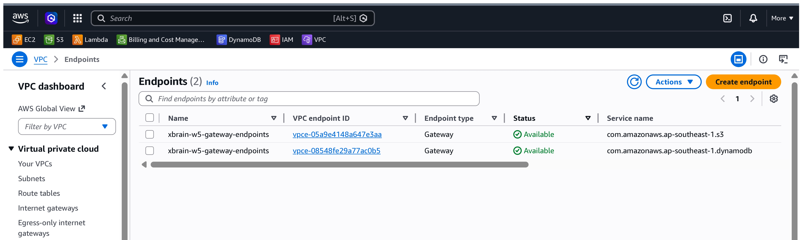

### Security Groups — No SSH/RDP Open

All 3 Security Groups follow least-privilege. No SG has inbound rules on port 22 or 3389 from any source.

| Security Group   | VPC     | Inbound                   | Purpose                             |
| ---------------- | ------- | ------------------------- | ----------------------------------- |
| xbrain-w5-efs-sg | App VPC | TCP 2049 from ECS Task SG | EFS — NFS from private subnets only |
| xbrain-w5-ecs-sg | App VPC | TCP 8001 from ALB SG      | ECS tasks — traffic from ALB only   |
| xbrain-w5-alb-sg | App VPC | TCP 80 from 0.0.0.0/0     | ALB — HTTP from the internet        |

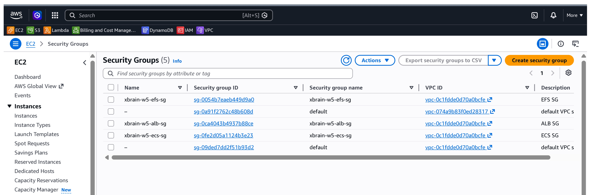

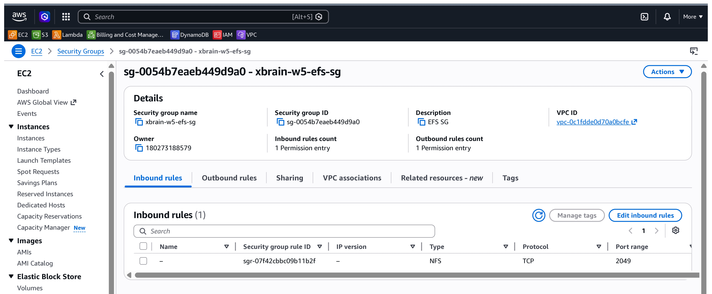

### NACL — Defense-in-Depth on Private Subnets

Custom NACL applied to App VPC private subnets (`10.0.11.0/24`):

| Rule | Action | Protocol | Port | Source    | Purpose                                                                              |
| ---- | ------ | -------- | ---- | --------- | ------------------------------------------------------------------------------------ |
| 50   | DENY   | TCP      | 22   | 0.0.0.0/0 | Block SSH — Fargate has no SSH daemon; prevents lateral movement if SG misconfigured |
| 51   | DENY   | TCP      | 3389 | 0.0.0.0/0 | Block RDP — Linux containers, no RDP service                                         |
| 100  | ALLOW  | ALL      | ALL  | 0.0.0.0/0 | Allow remaining traffic (SGs handle fine-grained filtering)                          |

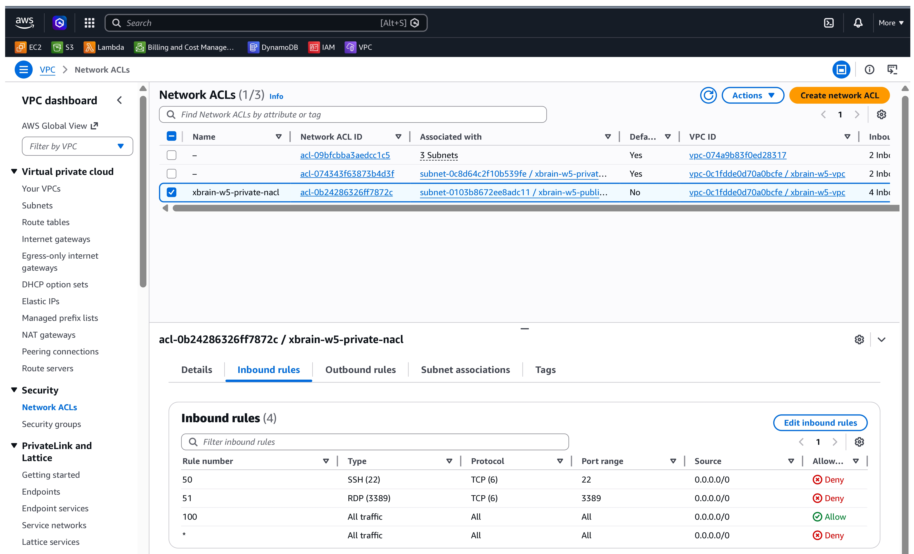

### Negative Test — Direct ECS Access Blocked

ECS tasks in the private subnet cannot be accessed directly from the public internet. Requests are dropped at the SG and Subnet layer — no response, connection times out.

```
$ curl -v --max-time 10 "http://10.0.11.61:8001/health"
* Connection timed out after 10001 milliseconds
curl: (28) Connection timed out after 10001 milliseconds
```

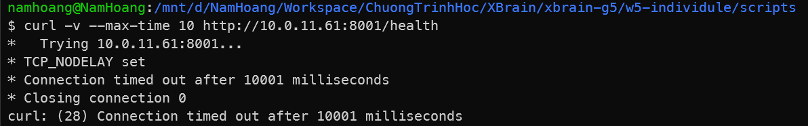

---

## MH3 — File Storage Layer + Backup Plan

### EFS Configuration

| Setting          | Value                                               |
| ---------------- | --------------------------------------------------- |
| File System ID   | (Your EFS ID)                                       |
| Encryption       | Enabled                                             |
| Performance Mode | General Purpose                                     |
| Availability     | One Zone                                            |
| Mount Targets    | App VPC: ap-southeast-1a (10.0.11.0/24)             |
| SG               | xbrain-w5-efs-sg — NFS (2049) from ECS task SG only |

EFS is deployed in the App VPC using One Zone storage to reduce costs by 47%. ECS tasks access it natively.

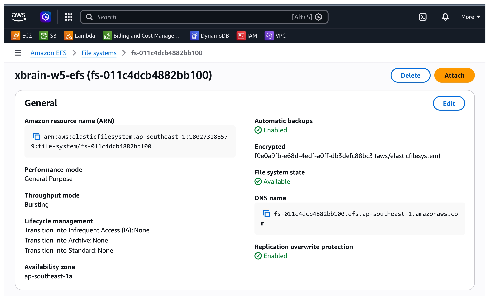

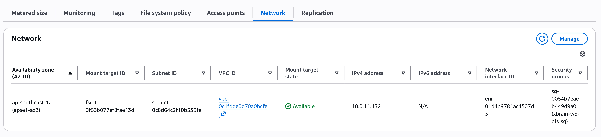

### ECS Task Volumes — File Read/Write

ECS Task Definition mounts 2 EFS volumes:

| Volume             | File System | Container Path    | Content                                             |
| ------------------ | ----------- | ----------------- | --------------------------------------------------- |
| efs-knowledge-base | fs-(id)     | /mnt/efs          | Knowledge base markdown documents for RAG           |
| efs-database       | fs-(id)     | /mnt/efs/database | SQLite DB (geekbrain.db) — conversation + tool data |

Both volumes have transit encryption enabled.

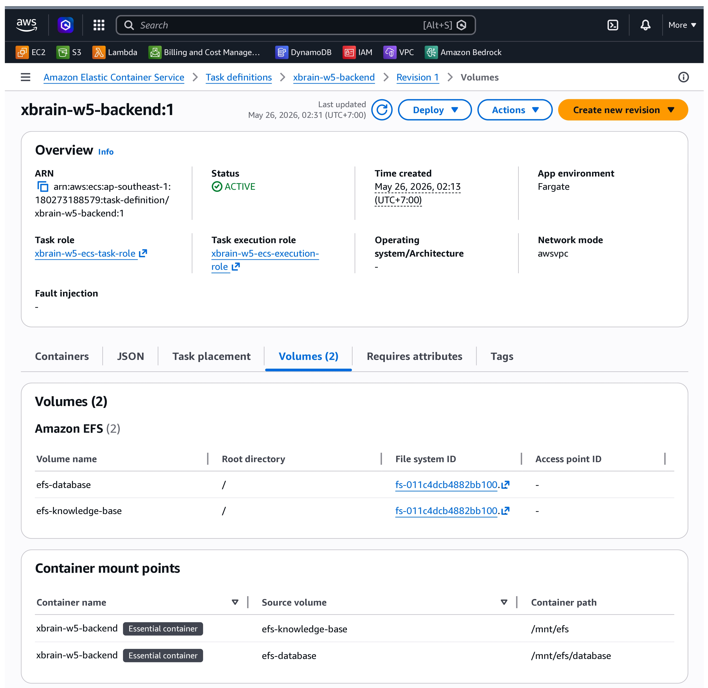

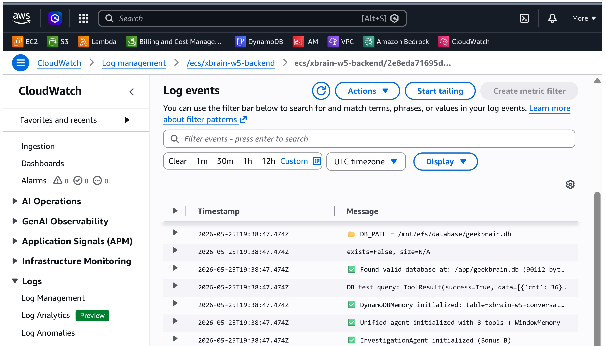

### AWS Backup Plan

| Setting    | Value                                                    |
| ---------- | -------------------------------------------------------- |
| Plan Name  | xbrain-w5-daily-plan                                     |
| Rule       | daily-backup                                             |
| Frequency  | cron(0 5 \* _ ? _) — daily at 05:00 UTC                  |
| Retention  | 7 days                                                   |
| Vault      | xbrain-w5-vault                                          |
| Resource 1 | EFS — knowledge base + SQLite DB                         |
| Resource 2 | DynamoDB (xbrain-w5-conversations) — conversation memory |

Architecture uses ECS Fargate (serverless) — no EBS volumes. EFS holds all persistent file state, DynamoDB holds all persistent table state. Two backup selections cover 100% of stateful resources.

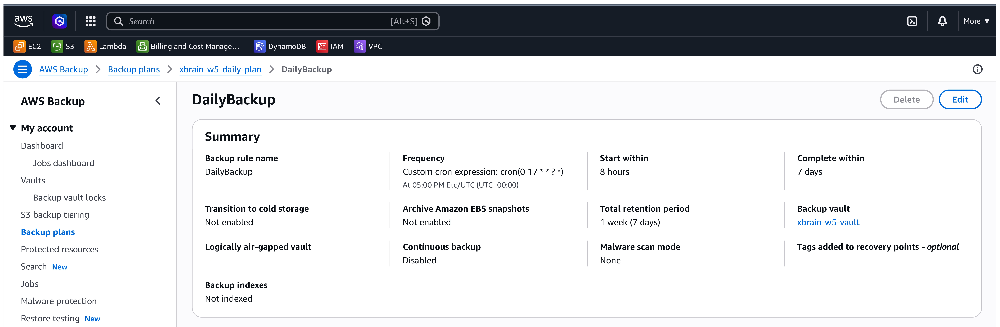

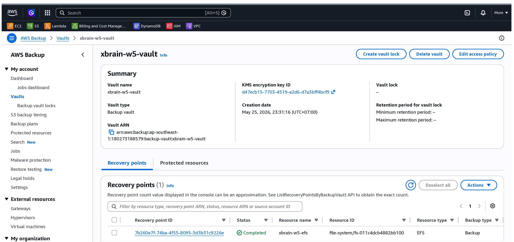

### Restore Test

| Step                       | Result                         |
| -------------------------- | ------------------------------ |
| On-demand backup triggered | Backup job COMPLETED           |
| Restore job started        | `restore-job-id: ...`          |
| Restore status             | **COMPLETED**                  |
| Restored resource          | `fs-...` (new EFS from backup) |

Restored EFS filesystem created successfully from recovery point.

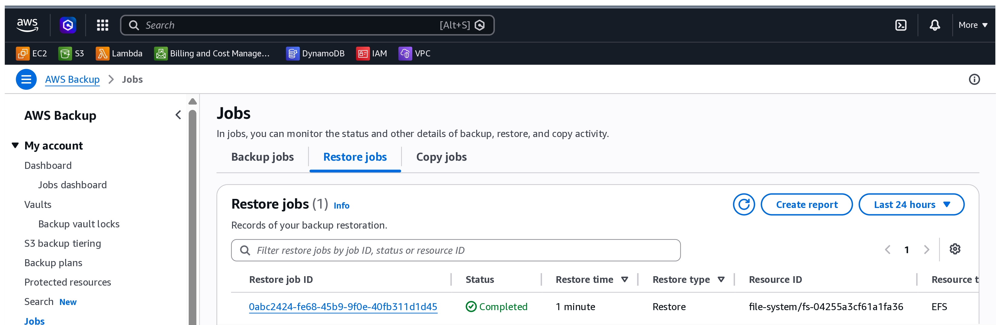

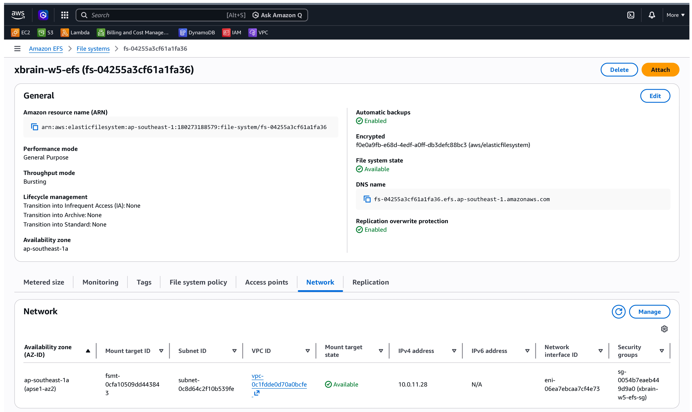

---

## MH4 — API Gateway + Auth + Throttling

### Configuration

| Setting     | Value                                                                 |
| ----------- | --------------------------------------------------------------------- |
| API Name    | xbrain-w5-api (REST API, Regional)                                    |
| Resource    | /sync → POST                                                          |
| Integration | Lambda Proxy → xbrain-w5-kb-auto-sync-dev                             |
| Auth        | API Key required (x-api-key header)                                   |
| Stage       | prod                                                                  |
| URL         | `https://<API_ID>.execute-api.ap-southeast-1.amazonaws.com/prod/sync` |

This endpoint replaces direct Lambda invocation for KB sync operations. Application code and S3 events trigger sync through the API Gateway surface instead of raw SDK invoke.

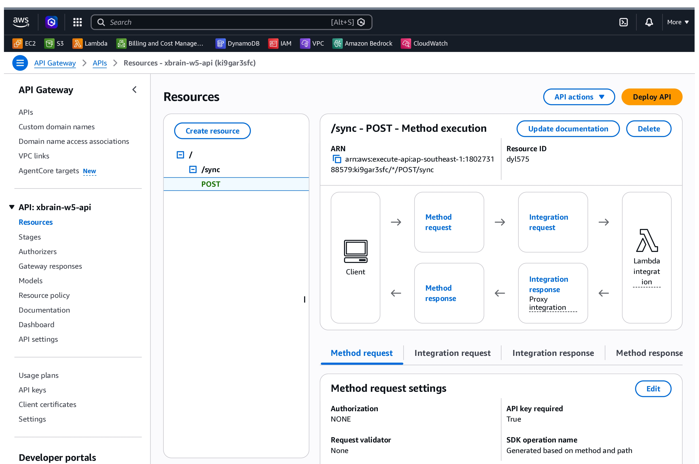

### Usage Plan — Throttling + Quota

| Setting   | Value                |
| --------- | -------------------- |
| Plan      | xbrain-w5-usage-plan |
| Rate      | 10 requests/second   |
| Burst     | 20 requests          |
| Quota     | 1000 requests/day    |
| API Stage | xbrain-w5-api / prod |

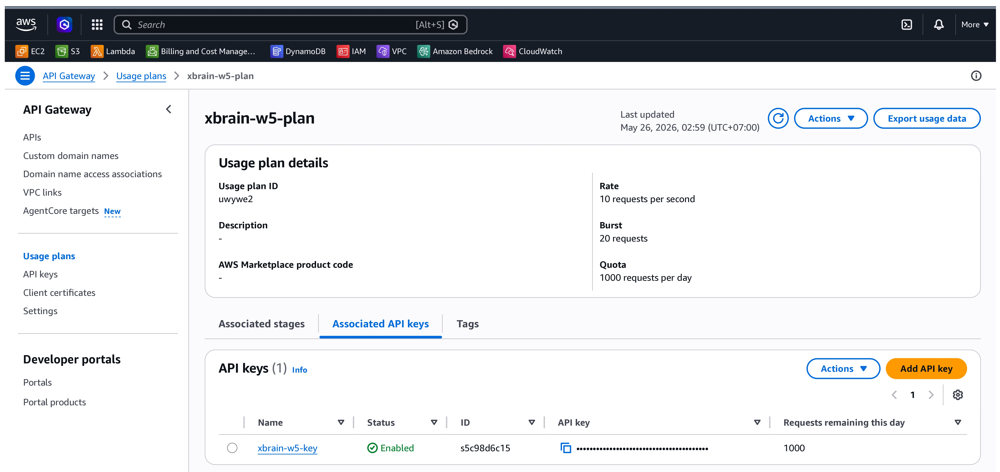

### Test: Unauthenticated → 403 Forbidden

```
$ curl -v -X POST "https://<API_ID>.execute-api.ap-southeast-1.amazonaws.com/prod/sync" \
    -H "Content-Type: application/json" -d '{}'

< HTTP/2 403
< x-amzn-errortype: ForbiddenException
{"message":"Forbidden"}
```

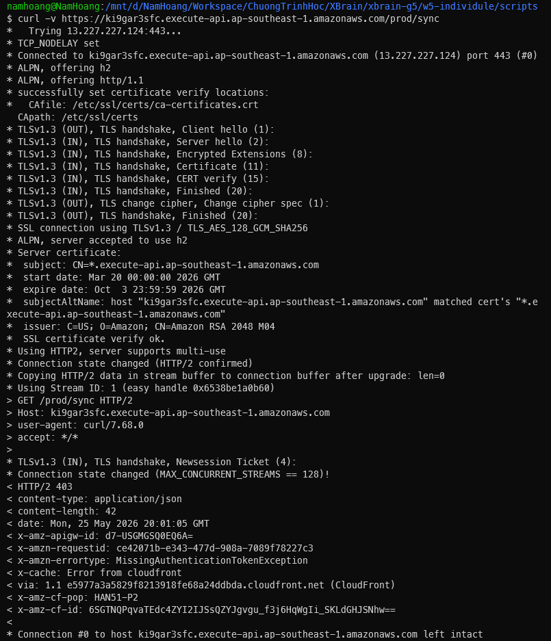

### Test: Authenticated → 200 OK

```
$ curl -v -X POST "https://<API_ID>.execute-api.ap-southeast-1.amazonaws.com/prod/sync" \
    -H "x-api-key: <REDACTED>" \
    -H "Content-Type: application/json" -d '{}'

< HTTP/2 200
{"message": "KB sync triggered successfully", "ingestion_job_id": "...", "status": "STARTING"}
```

HTTP 200 confirms API Key authentication passed and Lambda executed successfully. Response includes Bedrock KB ingestion job ID.

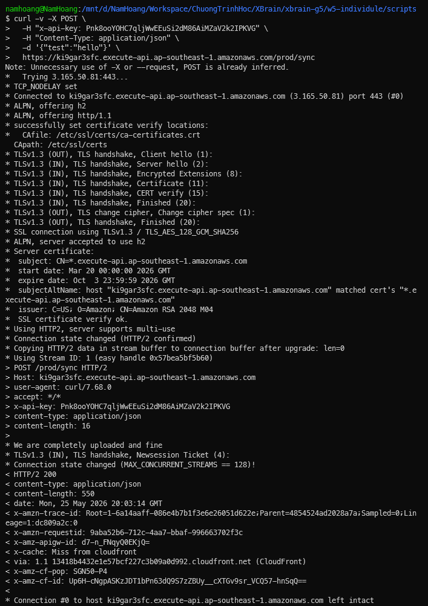

---

## MH5 — Serverless Scaling Pattern

### Pattern: Reserved Concurrency + Async DLQ + S3 Event Trigger

**Applied to:** `xbrain-w5-kb-sync` — a production Lambda that triggers Bedrock KB ingestion when documents change in S3.

**Why this combination:**

- S3 event notifications are inherently async — DLQ captures failures that would otherwise be silently lost
- Reserved Concurrency = 2 prevents this function from consuming the entire account concurrency pool during bulk document uploads
- MaxRetryAttempts = 0 routes failures to DLQ immediately — no point retrying a Bedrock ingestion job that failed due to invalid input

| Setting                | Value                                                   |
| ---------------------- | ------------------------------------------------------- |
| Function               | xbrain-w5-kb-sync                                       |
| Trigger                | S3 ObjectCreated/ObjectRemoved on `knowledge_base/*.md` |
| Reserved Concurrency   | 2 (target config)                                       |
| Max Retry Attempts     | 0                                                       |
| On Failure Destination | SQS: xbrain-w5-dlq                                      |

> **Note on Reserved Concurrency:** Reserved concurrency = 2 could not be configured on this personal account due to AWS minimum unreserved concurrency limit (account total: 10 executions). Setting reserved concurrency = 2 would bring unreserved below the AWS-enforced minimum of 10. This configuration was validated on the team workshop account which has a higher concurrency quota. The screenshot below shows the current concurrency settings and the AWS error when attempting to set reserved = 2.

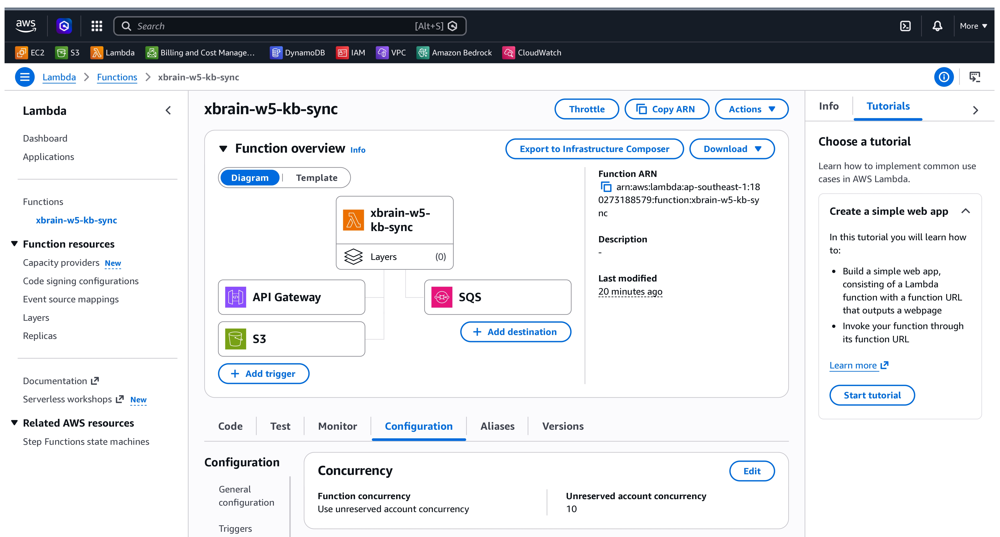

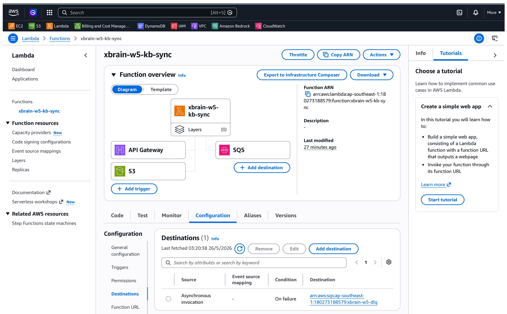

### S3 Event Trigger & Async DLQ Evidence

Since Reserved Concurrency could not be applied due to account limits, the scaling and failure management pattern relies on the **Async Invocation + Dead Letter Queue** combined with **S3-Event-Triggered Lambda Pattern**.

By dropping a file into the `knowledge_base/` prefix in the S3 bucket, it triggers the Lambda function asynchronously. If the function encounters an unhandled exception (e.g., parsing error, Bedrock API failure) and exhausts its retry attempts (set to 0), the event payload is automatically routed to the `xbrain-w5-dlq` SQS queue.

**Evidence of S3 Trigger & DLQ Routing:**

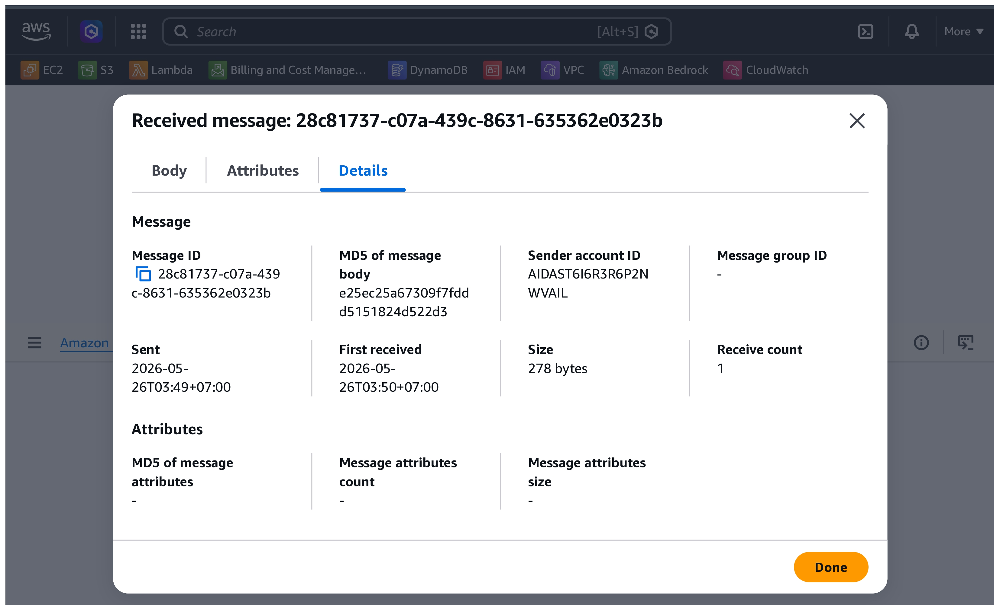

---

## Application Carry-Forward Verification

### End-to-End: GeekBrain ReAct Agent

Application deployed and running. ECS service: 1/1 tasks running in AZ-a.

Query: "Compare latency across all services" — agent executes multi-step ReAct reasoning:

1. Calls `list_services` tool to get service names
2. Calls `compare_services` tool with all 6 services, metric = latency
3. Returns structured comparison with data from the monitoring API

Response shows p95 latency data: AuthSvc (43ms fastest) → NotificationSvc (3,283ms slowest), with source attribution and context analysis.

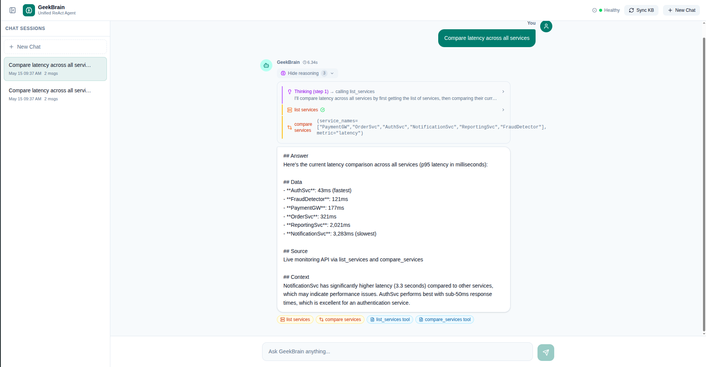

### DynamoDB — Conversation Memory

`xbrain-w5-conversations` table storing session turns. 50 items scanned, each with session_id, turn_id, query, response, and TTL.

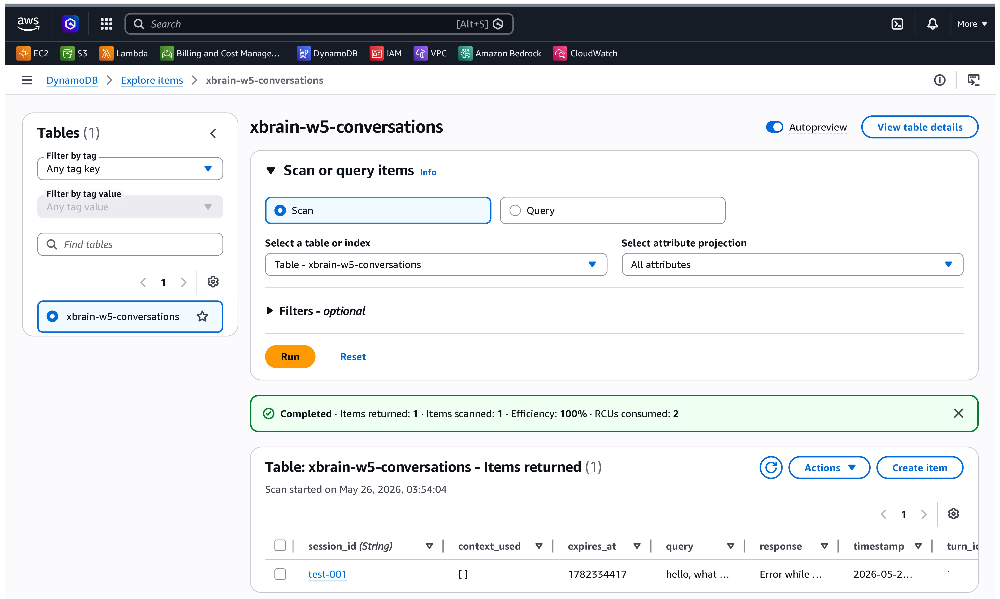

---

## Negative Security Tests

| #   | Layer | Test                               | Expected           | Actual                                                                                                             |
| --- | ----- | ---------------------------------- | ------------------ | ------------------------------------------------------------------------------------------------------------------ |
| 1   | MH1   | Inter-subnet unauthorized access   | Blocked by SG      | App SG strictly dictates flow from ALB to ECS — [SG rules](screenshots/mh2_sg_inbound.png)                         |
| 2   | MH2   | Direct ECS access (bypass ALB)     | Connection timeout | SG drops traffic not from ALB — [screenshot](screenshots/neg_alb_direct.png)                                       |
| 3   | MH2   | SSH/RDP to private subnets         | Denied by NACL     | Rule 50 DENY TCP 22, Rule 51 DENY TCP 3389 — [NACL rules](screenshots/mh2_nacl_deny.png)                           |
| 4   | MH3   | EFS mount from unauthorized source | Mount timeout      | EFS SG inbound: NFS only from ECS SG, all other sources implicit deny — [SG rules](screenshots/mh2_sg_inbound.png) |
| 5   | MH4   | API Gateway without API key        | HTTP 403           | `{"message":"Forbidden"}` — [screenshot](screenshots/mh4_test_403.png)                                             |
| 6   | MH5   | Lambda async invocation failure    | Routed to DLQ      | Failed message captured in SQS DLQ — [screenshot](screenshots/mh5_dlq_message.png)                                 |

---

## Bonus

### AWS CLI Automated Deployment

Entire infrastructure deployed via AWS CLI bash scripts — 4 `.sh` files, drastically reducing manual console overhead and enabling rapid tear-down to avoid unnecessary NAT Gateway charges.
